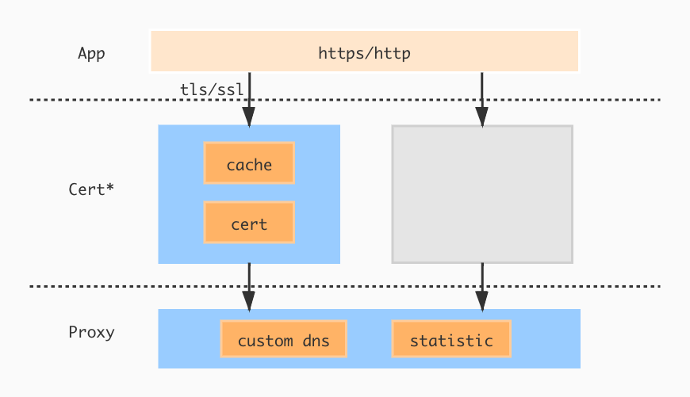

# GoIyov

#### 介绍
golang 代理


#### 安装教程
```bash
 go get github/nicecp/GoIyov
```

#### 支持特性
* HTTP/HTTPS代理
* TLS/SSL解密
* MITM(中间人攻击)
* 自定义DNS
* Certiface缓存
* Statistic统计(开发中)

#### 使用说明

> ***双击 `cert/caRoot.crt`根证书文件，并信任该证书***

##### 代理使用
```go
package main
import (
	"github.com/nicecp/GoIyov"
	"net/http"
	"time"
)

func main() {
	proxy := GoIyov.New()
	server := &http.Server{
		Addr:         ":8888",
		Handler:	  http.HandlerFunc(func(rw http.ResponseWriter, req *http.Request) {
			proxy.ServerHandler(rw, req)
		}),
		ReadTimeout:  30 * time.Second,
		WriteTimeout: 30 * time.Second,
	}
	err := server.ListenAndServe()
	if err != nil {
		panic(err)
	}
}
```
##### MITM(中间人攻击)
```go
package main

import (
	"fmt"
	"github.com/nicecp/GoIyov"
	"github.com/nicecp/GoIyov/entity"
	"net/http"
	"time"
)

type Handler struct {
	GoIyov.Delegate
}

func (handler *Handler) BeforeRequest(entity *entity.Entity) {
	fmt.Printf("%+v",entity.GetRequestBody())
}
func (handler *Handler) BeforeResponse(entity *entity.Entity, err error) {
	fmt.Printf("%+v",entity.GetResponseBody())
}
func (handler *Handler) ErrorLog(err error) {}

func main() {
	proxy := GoIyov.NewWithDelegate(&Handler{})
	server := &http.Server{
		Addr: ":8888",
		Handler: http.HandlerFunc(func(rw http.ResponseWriter, req *http.Request) {
			proxy.ServerHandler(rw, req)
		}),
		ReadTimeout:  30 * time.Second,
		WriteTimeout: 30 * time.Second,
	}
	err := server.ListenAndServe()
	if err != nil {
		panic(err)
	}
}
```
